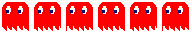
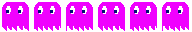
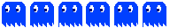

<div align="center"> 

  <h3>Pac-Man</h3>

  
  
  
  
</div>

## Description

This project have been made for me to learn `C` and `SDL2` library.

## Usage

To compile the project, you need to have `SDL2` and `SDL2_image` installed on your computer.

Then, you can compile the project with the following command:

```bash
cd src
make
```

This will create a `pacman` executable in the `bin` folder.

To run the game, you can use the following command:

```bash
cd bin
chmod +x pacman
./pacman
```

To clean the project, you can use the following command:

```bash
cd src
make clean
```

This will remove all the `.o` files and the `pacman` executable.

## Features

* Custom level file format (see <a href="#leveling">Leveling</a>)
* Custom tileset file format (see [tileset.png](assets/textures/tileset.png))
* Custom font file format (see [font.ttf](assets/font.ttf)) (note that the default font is Open Sans Regular from Google Fonts)
* Sprite animation (ghosts and pacman) :
  * Ghosts (see <a href="#ghosts">Ghosts</a>)
  * Pacman (see <a href="#pacman">Pacman</a>)
* Ghost AI (Blinky, Pinky, Inky and Clyde)
* Bonus (cherry, strawberry, orange, apple) (see <a href="#bonus">Bonus</a>)

## Leveling

You can create your own level by editing `level.txt` file in the `data` folder.

All the tiles are defined in the [tileset.png](assets/textures/tileset.png) file.

Here is the list of all the tiles:

> Note that the tileset is composed of 32x32 tiles.

> Note also that you have multiple walls types (see [tileset.png](assets/textures/tileset.png)). You have a wall type that is taken the 2/3 of the tile and another one that is taken the 1/3 of the tile, the last one is centered in the tile.

| Tile | Description | Character |
| --- | --- | --- |
| Accessible tiles |
|  | Empty tile | `0` |
|  | Dot tile | `.` |
|  | Big dot tile | `p` |
|  | Wall full tile | `#` |
| 2/3 wall tiles |
|  | Wall tile down | `d` |
|  | Wall tile up | `u` |
|  | Wall tile left | `l` |
|  | Wall tile right | `r` |
| 1/3 wall tiles |
|  | Horizontal tile | `=` |
|  | Horizontal tile left | `<` |
|  | Horizontal tile right | `>` |
|  | Vertical tile | `|` |
|  | Vertical tile up | `^` |
|  | Vertical tile down | `v` |
| 2/3 Corner tiles |
|  | Bottom left corner tile | `1` |
|  | Bottom right corner tile | `2` |
|  | Top left corner tile | `3` |
|  | Top right corner tile | `4` |
| 1/3 Corner tiles |
|  | Bottom left corner tile | `[` |
|  | Bottom right corner tile | `]` |
|  | Top left corner tile | `(` |
|  | Top right corner tile | `)` |
| 1/3 T tiles |
|  | T tile down | `s` |
|  | T tile up | `z` |
|  | T tile left | `q` |
|  | T tile right | `f` |
| Cross tiles |
|  | Cross tile | `+` |

## Ghosts

The ghosts are controlled by a random algorithm. The ghosts can move in 4 directions (up, down, left and right). The ghosts can't move in the opposite direction of their current direction.

| Ghost | Color | Sprite |
| --- | --- | --- |
| Blinky | Red |  |
| Pinky | Pink |  |
| Inky | Cyan |  |
| Clyde | Orange |  |
| Scared ghost | White / Blue |  |

## Bonus

The bonus will appear at a random interval of time and have a random position on the map. The bonus will disappear after a certain amount of time. Then the bonus will automatically reappear at a random interval of time and have a random position on the map.


## Pacman

Pacman is controlled by the player. The player can move in 4 directions (up, down, left and right).

The player goal is to eat all the dots and the bonus. The player can eat the ghosts after eating a big dot (the ghosts will be scared for a certain amount of time).


## Controls

| Key | Action |
| --- | --- |
| `arrow up` | Move up |
| `arrow down` | Move down |
| `arrow left` | Move left |
| `arrow right` | Move right |
| `space` | Start the game |
| `escape` | Pause the game |
| `lctrl + f` | Toggle FPS |
| `lalt + f4` | Quit the game |
| `lctrl + r` | Restart the game |
| `enter` | Validate action |

## Screenshots


> Start screen


> Game screen


> Pause screen


> Ghosts scared


> Bonus


> Game over screen

## Contributing

Feel free to contribute to this project by forking it and making a pull request.

If you find any bug or have any suggestion to improve the project, please open an issue.

You will find a list of things that I would like to add or fix in the [TODO](TODO.md) file.

## License

This project is licensed under the MIT License - see the [LICENSE](LICENSE) file for details

## Author

* **[Hokanosekai](https://gihub.com/hokanosekai)** - *Initial work*

## Acknowledgements

* [SDL2](https://www.libsdl.org/)
* [SDL2_image](https://www.libsdl.org/projects/SDL_image/)
* [SDL2_ttf](https://www.libsdl.org/projects/SDL_ttf/)